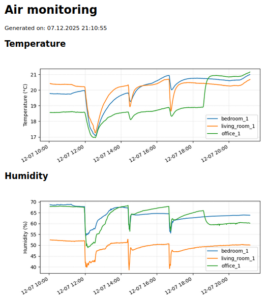
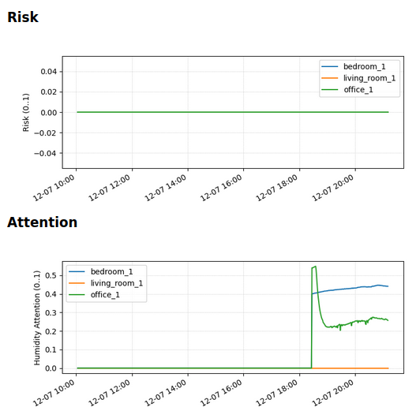
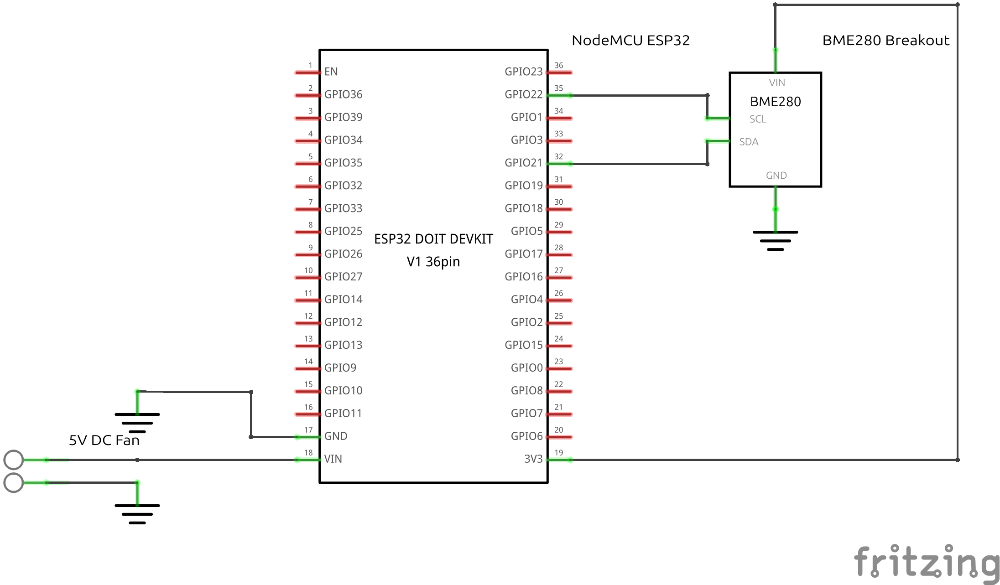
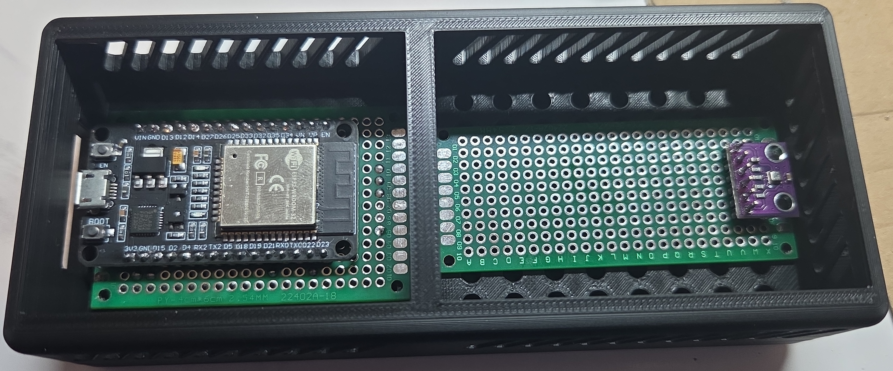

# Humidity_Temp_Monitor

Distributed monitoring platform using ESP32+BME280 sensor nodes for temperature and humidity tracking. A Raspberry Pi collects all data and provides visualizations via a local web server.

## What does this do?

This project sets up a lightweight Raspberry Pi server to listen for ESP32 sensor nodes that periodically fetch temperature and humidity from BME280 sensors. After receiving data, the Raspberry Pi periodically evaluates the log it created when receiving a new push. Apart from temperature and humidity, it also calculates a “risk” and an “attention factor” for mould based on the given measurements and the dew point derived from them. All results are displayed on a lightweight local web server and are updated every minute.

The Dashboard features:

- Temperature & humidity history (last 24 h)
- Calculated mould risk factor
- Attention factor (early warning metric)

<div style="display: flex; gap: 10px;">
  
  
</div>

### What are "Risk" and “Attention”?

**Risk** is an indicator for the probability of mould formation indoors. It is calculated as follows:

- If humidity < 55%: Risk = 0  
- If humidity >= 55%:  
  - `delta t` = temperature – dew point  
  - If `delta t` > 5 °C: Risk = 0  
  - If `delta t` <= 1 °C: Risk = 1  
  - If `delta t` is between 1 °C and 5 °C: linear scaling from 0 to 1  

**Attention** highlights situations that are not yet critical but are trending towards risk, for example rising humidity combined with decreasing dew point distance.

## Features

- Distributed ESP32 sensor nodes (temperature, humidity, pressure)
- Raspberry Pi ingestion server (Flask)
- Hash-chained measurement log (tamper evidence)
- Dew point calculation
- Mould risk + attention factor model
- Auto-generated dashboard (updated every minute)
- Local web server (no cloud dependency)

## Setup Raspberry Pi

Run the setup script located in the main folder of this repository:

```bash
./init_raspberrypi.sh

```

Make sure your Raspberry Pi has a network connection.

After installation, open the dashboard in your browser:
`http://<raspberry-pi-ip>:8000/index.html`

## Setup ESP Boards

ESP32 firmware is located in `ESP32/src/main.cpp`.

To connect the ESP32 sensor stations to WiFi, SSID and password must be stored in a file. The file `ESP32/include/secrets.h` is intentionally excluded from this repository and must be created manually.

### Example configuration of ```secrets.h```

```hpp
#pragma once

static const char *WIFI_SSID = "YOUR_SSID";
static const char *WIFI_PASS = "YOUR_PASSWORD";
```

After adding the `secrets.h` file, replace the `serverUrl` value with your Raspberry Pi's hosted server address, and give your node a name by changing the `nodeId` variable's value.

## Hardware Design Rationale

The sensor enclosure is divided into two separate chambers to ensure reliable and unbiased measurements:

- **Chamber 1 – ESP32 + electronics**  
  This compartment is ventilated to dissipate the ESP32’s self-heating. Active airflow prevents heat buildup that would otherwise influence the sensor readings.

- **Chamber 2 – BME280 sensor**  
  This compartment is intentionally **not** ventilated. Moving air cools the sensor slightly and would distort temperature and humidity values. The sensor therefore operates in still air, which is required for stable indoor-climate measurements.

The only connection between the chambers is a small cable pass-through located at the bottom of the dividing wall. Since warm air rises, positioning the opening low in the enclosure minimizes thermal leakage from the ESP chamber into the sensor chamber.

This passive separation ensures that the BME280 is not affected by the ESP32’s heat or airflow, resulting in more accurate and repeatable measurements.

## Parts Used

- [JOY-IT NodeMCU ESP32](https://joy-it.net/en/products/SBC-NodeMCU-ESP32)
- [BME 280 Breakout (any other BME280 Breakout will work just fine)](https://www.reichelt.de/de/de/shop/produkt/entwicklerboards_-_temperatur-_feuchtigkeits-_und_drucksensor_-253982?PROVID=2788)
- Generic DC5V Fan 30 x 30 x 7.5mm
- Generic PCB boards
- Raspberry Pi 2 Model B+
- Assortment of screws (M2x8mm) and nuts (M2)

## Sensor Station Assembly

1. Solder the NodeMCU onto any PCB (e.g. ELEGOO Double-Sided PCB Kit 4 × 6 cm)
2. Solder the BME280 onto any PCB (e.g. ELEGOO Double-Sided PCB Kit 3 × 7 cm)
3. 3D-Print `CAD/ESP_CASE_CHAMBERS_BODY.stl`
4. Place PCBs into the case and connect all parts according to the scheme:





5. Screw PCBs in place using M2×8 mm screws
6. 3D-Print `CAD/ESP_LID_CHAMBERS-Body.stl`
7. Mount the fan using M2×8 mm screws and M2 nuts
8. Slide the lid onto the case
